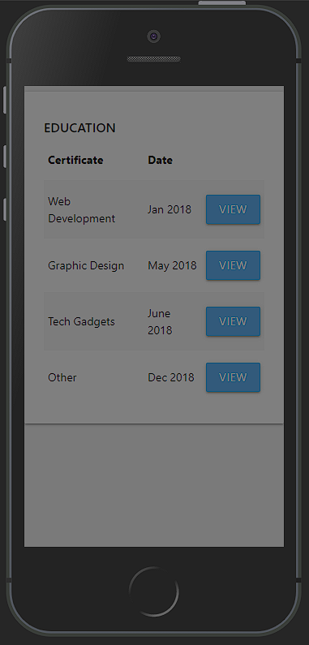
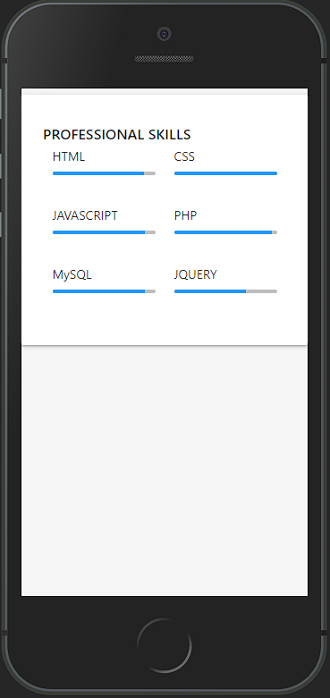

# Introduction

Ce projet est une fois de plus un CV en Réact. Lien de la vidéo : [Build CV - Use React to create a CV website](https://www.youtube.com/watch?v=la11Z4FvPk0)

# Intérêts du projet

Ce CV continue mon apprentissage de Réact. Lors de ce projet, nous utilisons MaterializeCSS et FontAwesome, ce qui me permettra de voir comment m'en servir avec Réact.

# Problèmes rencontrés

J'ai rencontré plusieurs problèmes liés à l'animation du menu. Dans la vidéo, le développeur utilise jQuery, ce que je souhaitai éviter avec Réact.

Outre cela, sur mobile le menu s'affiche mais après avoir cliqué sur un lien, le fond du menu reste affiché. Un clic suffit à le faire disparaitre, mais le menu reste comme "ouvert", donc ne s'ouvre plus.

De plus, les liens du menu menaient vers une nouvelle page avec uniquement le contenu de la section souhaitée, comme le montre l'image ci-dessous :

# Ce que m'a apporté ce projet

# Améliorations possibles

# Screenshots du résultat

